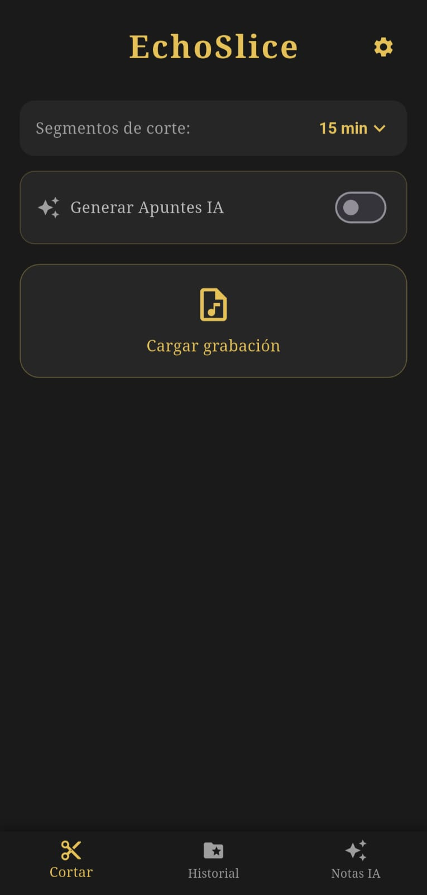
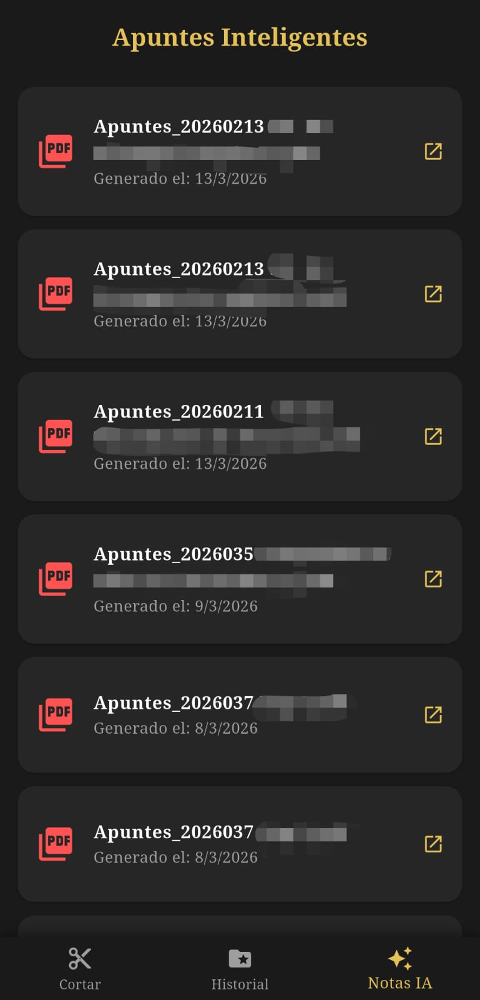

# EchoSlice 🎧🐱
**Automated AI-Powered Audio Slicing & Note-Taking Assistant**

EchoSlice is a high-performance mobile application built with **Flutter** designed to transform long, unstructured audio recordings (lectures, meetings, personal reflections) into organized, high-quality study notes and journals. 

By combining automated audio processing with **Google Gemini AI**, EchoSlice bridges the gap between raw audio and actionable knowledge.

## 🚀 Key Features

* **Smart Audio Slicing:** Automatically splits long audio files into manageable 5, 10, or 15-minute segments to optimize AI processing and prevent information loss.
* **AI Context-Aware Summarization:** Utilizes the **Gemini 2.5 Flash** model to generate structured notes based on custom-engineered prompts.
* **Dual-Template System:**
    * **Type A (Academic/Technical):** Focuses on objectives, key concepts, and technical implementation/code.
    * **Type B (Personal/Journal):** Focuses on storytelling, mood, reflections, and life highlights.
* **Professional PDF Export:** Aggregates AI-generated insights from multiple audio segments into a single, clean, and printable PDF document.
* **Privacy-First (BYO Key):** Secure local storage of API Keys using `shared_preferences`. The app does not hardcode sensitive credentials, making it safe for open-source contribution.
* **Background Resilience:** Implements `wakelock_plus` and optimized async pipelines to ensure processing continues even if the screen turns off.

## 🛠️ Tech Stack

* **Framework:** Flutter (Dart)
* **AI Engine:** Google Generative AI (Gemini API)
* **Audio Engine:** `just_audio` & custom `FFmpeg` / `AudioCutter` services.
* **State Management:** `StatefulWidgets` with optimized Lifecycle handling.
* **Persistence:** `shared_preferences` for secure API Key management.
* **Document Generation:** `pdf` & `open_filex` for creation and native viewing.

## 📸 Screenshots

| Home Screen | AI Notes History |
| :---: | :---: |
|  |  |

## 📦 Installation & Setup

1.  **Clone the repository:**
    ```bash
    git clone [https://github.com/your-username/echoslice.git](https://github.com/your-username/echoslice.git)
    ```
2.  **Install dependencies:**
    ```bash
    flutter pub get
    ```
3.  **Run the app:**
    ```bash
    flutter run
    ```
4.  **Configure API Key:**
    * Open the app.
    * Tap the **Settings (⚙️)** icon.
    * Paste your **Gemini API Key** (Get one at [Google AI Studio](https://aistudio.google.com/)).
    * Save and start slicing!

## 🛡️ Security & Best Practices

This project follows industry-standard best practices:
* **Clean Code:** Modular service-based architecture.
* **Git Integrity:** `.gitignore` configured to prevent leaking of sensitive configuration files.
* **Rate-Limit Handling:** Implementation of retry logic and cool-down periods to respect Google API's Free Tier limits.

---
Developed with ❤️ by Boxy - Luis Axel Cruz G.